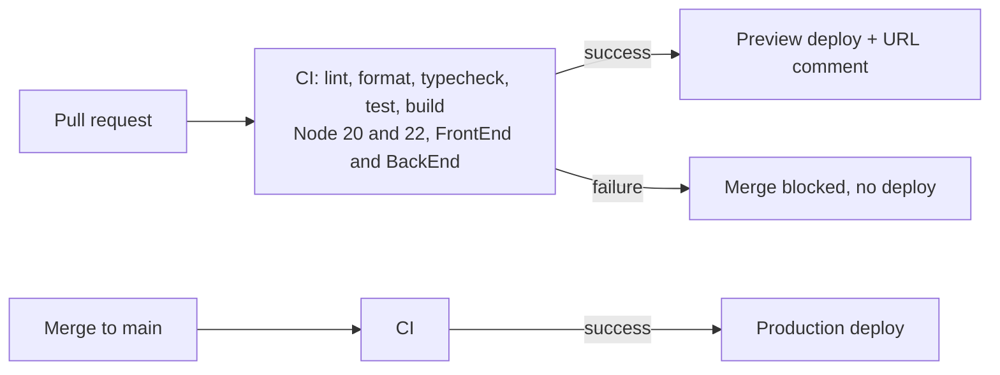

# MEDVIA

Medical equipment e-commerce platform, maintained by Raza Hussain. React + Vite frontend, Node.js + Express +
MongoDB backend, with a GitHub Actions CI/CD pipeline for the frontend.

Original application code: Mustafa Mubashir (Biova Surgicals), ISC License. See `LICENSE`.

## What and why

The client is an established medical equipment supplier. The goal of this task was a safe release process: every
change is linted, type-checked, tested and built automatically, a failing pull request cannot be merged, every
pull request gets a preview, and a bad release can be rolled back quickly. Scope and plan: `docs/SCOPE.md`,
`docs/PLAN.md`. Target: PR pipeline under 5 minutes with cache, at least 10 tests, zero `any`, failing PRs cannot merge.

## Tools

| Area     | Tool                                                                                     |
| -------- | ---------------------------------------------------------------------------------------- |
| Frontend | React 19, Vite, Tailwind CSS 4, Redux Toolkit, React Router                              |
| Backend  | Express, Mongoose, TypeScript                                                            |
| Quality  | TypeScript (strict, `noUncheckedIndexedAccess`), ESLint with typescript-eslint, Prettier |
| Tests    | Vitest, Testing Library, supertest                                                       |
| CI/CD    | GitHub Actions, Vercel CLI                                                               |

## Pipeline



Workflows: `.github/workflows/ci.yml` and `.github/workflows/deploy.yml`. Decisions: `docs/DECISIONS.md`.

## Before and after

Only real, measured numbers. Cells marked FILL IN are measured by the maintainer after the pipeline runs.

| Metric                           | Before                       | After                                                                       | Source                                 |
| -------------------------------- | ---------------------------- | --------------------------------------------------------------------------- | -------------------------------------- |
| `npm ci` passes (FrontEnd)       | No: peer dependency conflict | FILL IN (first CI run)                                                      | `docs/gap-analysis.md`; CI run         |
| Lint errors                      | 2                            | FrontEnd 0, BackEnd FILL IN                                                 | `docs/gap-analysis.md`; `npm run lint` |
| Type errors caught in conversion | not applicable               | 0 on the first real run                                                     | `docs/TYPE-ERRORS.md`                  |
| `any` and `@ts-ignore` in source | not measured                 | FILL IN (`grep -rnE ': any\|@ts-ignore' FrontEnd/src BackEnd/src`)          | grep                                   |
| Tests                            | 0                            | FILL IN passing (23 written: 15 FrontEnd, 8 BackEnd)                        | `npm test`                             |
| FrontEnd production build        | not measured                 | 31.07 s locally; JS 436.10 kB (137.06 kB gzip), CSS 26.69 kB (6.13 kB gzip) | `npm run build`                        |
| Pipeline time, cold cache        | none                         | FILL IN                                                                     | Actions run page                       |
| Pipeline time, warm cache        | none                         | FILL IN                                                                     | Actions run page                       |
| Rollback time                    | none                         | FILL IN                                                                     | `docs/RUNBOOK-ROLLBACK.md`             |

## Run locally

```bash
cd BackEnd  && cp .env.example .env && npm install && npm run dev      # API on http://localhost:8000
cd FrontEnd && cp .env.example .env && npm install && npm run dev      # site on http://localhost:5173
```

Quality checks in each package: `npm run lint`, `npm run format:check`, `npm run typecheck`, `npm test`, `npm run build`.

Configuration is in `FrontEnd/.env.example` (`VITE_API_URL`, `VITE_COMMIT_SHA`) and `BackEnd/.env.example`
(`PORT`, `MONGO_URI`, `MONGO_DB_NAME`, `CORS_ORIGINS`, `COMMIT_SHA`). Never commit a real `.env`.

## Release and rollback

Open a pull request; merge needs green checks and one approval. Merging to `main` deploys production. The footer shows
the live commit SHA. To undo a release see `docs/RUNBOOK-ROLLBACK.md`.

## Limitations and next improvement

- **Limitation.** Only the frontend is deployed by the pipeline, so previews use one shared API. Backend tests do not
  touch a real database, and there are no end-to-end browser tests. The add-product and add-blog endpoints have no
  authentication.
- **Improvement.** Deploy the backend with its own preview environments, then add Playwright end-to-end tests of the
  cart and checkout against that environment.

## What is mine and what is original

- **Original (Mustafa Mubashir, 2025):** the first version of the store, the Express and Mongoose API, and the
  product and order data models.
- **Mine (Raza Hussain, 2026):** CI and deploy workflows, branch protection setup, TypeScript migration, ESLint and
  Prettier setup, the tests, environment-driven configuration, the footer commit SHA, the rollback runbook, and all
  documents in `docs/`.
- **AI assistance:** the MEDVIA visual redesign, parts of the TypeScript conversion, the tests and these documents
  were drafted with Claude (Anthropic) and then run and checked by me. Edit this line to match your course rules.
